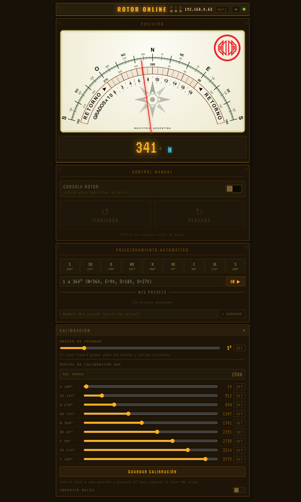
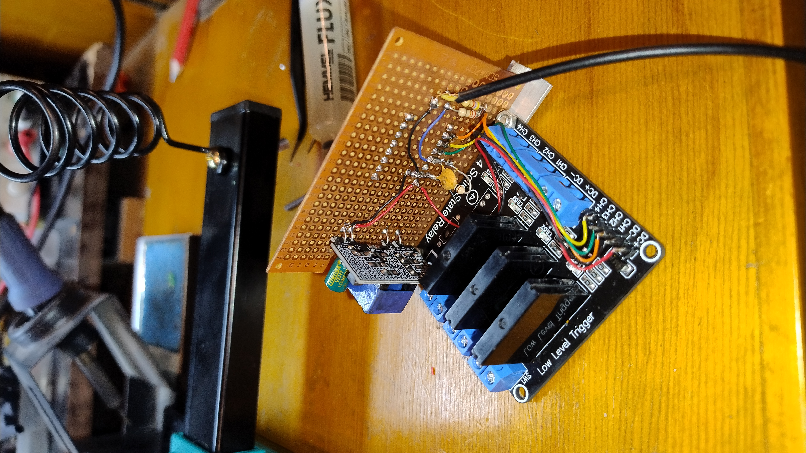

# 🛰️ Control de Rotor — ESP32-C3 SuperMini (por LU4AFJ)

Control de rotor de antena vía WiFi con interfaz web embebida. Diseñado para rotores de antena de radioaficionado Walmar, permite girar y posicionar la antena desde cualquier dispositivo con navegador (celular, tablet o PC) en la red local.



## Qué hace

- **Control manual** — Botones de giro izquierda/derecha con pulsación continua (mantener presionado)
- **Posicionamiento automático** — Seleccioná un punto cardinal o ingresá un ángulo exacto (1°–360°) y el rotor gira solo hasta esa posición, frenando y corrigiendo con pulsos
- **Brújula en tiempo real** — Indicador visual tipo dial que muestra la posición actual de la antena
- **Presets** — Guardá posiciones favoritas con nombre para acceso rápido (satélites, repetidoras, etc.)
- **Calibración** — Sistema de hasta 9 puntos de calibración ADC para mapear la posición del potenciómetro del rotor a grados reales
- **Configuración WiFi** — Portal cautivo (captive portal) para configurar la red WiFi sin necesidad de editar código
- **Reconexión automática** — Si se pierde la conexión WiFi, reintenta cada 30 segundos
- **Tema claro/oscuro** — Interfaz con estética retro-industrial, switcheable entre modo oscuro y claro

## Hardware necesario

| Componente | Detalle |
|---|---|
| **Microcontrolador** | ESP32-C3 SuperMini |
| **Módulo de SSR** | 4 canales, activo LOW (5V compatible) |
| **Divisor de tensión** | Para adaptar la salida del potenciómetro del rotor al rango 0–3.3V del ADC |
| **Capacitor** | 100nF cerámico entre GPIO4 y GND (filtro de ruido ADC) |

## Conexiones

```
ESP32-C3          Módulo Relés
────────          ────────────
GPIO 2  ───────►  IN1 → Relé POWER
GPIO 1  ───────►  IN2 → Relé IZQUIERDA
GPIO 3  ───────►  IN3 → Relé DERECHA
3.3V    ───────►  VCC
GND     ───────►  GND

ESP32-C3          Rotor (potenciómetro)
────────          ────────────────────
GPIO 4  ◄──┬───  Divisor de tensión (pin 6 → 100kΩ → GPIO4 → 27kΩ → GND/pin 7)
           │
         100nF
           │
          GND
```

## Instalación

### Requisitos

- **Arduino IDE** con soporte ESP32
- **Board:** `ESP32C3 Dev Module`
- **USB CDC on Boot:** `Enabled` ← importante para el serial por USB
- **Librería:** [ArduinoJson](https://arduinojson.org/) v6.x (instalar desde Library Manager)

### Pasos

1. Cloná el repositorio
2. Abrí `rotor_controller__6_.ino` en Arduino IDE
3. Verificá que `index_html.h` esté en la misma carpeta
4. Seleccioná la placa `ESP32C3 Dev Module` y habilitá `USB CDC on Boot`
5. Compilá y flasheá

### Primer uso

1. Al encender por primera vez, el ESP crea la red WiFi **"RotorCtrl"** (contraseña: `rotor1234`)
2. Conectate a esa red desde tu celular o PC
3. Se abre automáticamente la página de configuración (o ingresá a `192.168.4.1`)
4. Seleccioná tu red WiFi e ingresá la contraseña
5. El ESP se reinicia y se conecta a tu red — el LED azul queda encendido fijo al conectar
6. Accedé a la interfaz en `http://rotor.local/rotor` o por la IP que muestra en el Serial Monitor

## Uso

### Control manual

Activá la consola (switch de POWER) y usá los botones de **IZQUIERDA** / **DERECHA**. El rotor gira mientras mantenés presionado.

### Posicionamiento automático

Tocá un punto cardinal (N, NE, E, SE, S, SO, O, NO) o ingresá un ángulo específico y confirmá. El rotor gira automáticamente, frena antes del destino y corrige con pulsos cortos hasta alcanzar la posición.

### Calibración

1. Abrí la sección **Calibración**
2. Girá el rotor físicamente a cada posición conocida
3. Presioná **SET** en cada punto para capturar el valor ADC
4. Ajustá el **Margen de Frenado** según la inercia de tu rotor
5. Guardá la calibración

### Presets

Posicioná el rotor donde querés, escribí un nombre y tocá **+ GUARDAR**. Los presets quedan en el navegador para acceso rápido.

## Reset WiFi

Mantené presionado el botón **BOOT** del ESP32-C3 durante 5 segundos. Las credenciales WiFi se borran y el ESP reinicia en modo AP para configurar una nueva red.

## API HTTP

El controlador expone una API REST para integración con otros sistemas:

| Endpoint | Método | Descripción |
|---|---|---|
| `/position` | GET | Posición actual (ADC, grados, estado de relés, RSSI) |
| `/cmd?action=power_on` | GET | Encender consola |
| `/cmd?action=power_off` | GET | Apagar consola y relés |
| `/cmd?action=left_start` | GET | Girar a la izquierda |
| `/cmd?action=right_start` | GET | Girar a la derecha |
| `/cmd?action=stop` | GET | Detener giro |
| `/calibration` | GET | Obtener calibración actual |
| `/calibration` | POST | Guardar nueva calibración (JSON) |
| `/reopen-ap` | GET | Reabrir el AP para configuración WiFi |

## Notas técnicas

- **ADC:** Mediana deslizante de 32 muestras con zona muerta de 20 counts (~0.9°) para filtrar ruido del WiFi sin lag
- **ESP32-C3 SuperMini:** Requiere `WiFi.setTxPower(WIFI_POWER_8_5dBm)` para el AP — la fuente del módulo no soporta potencia de transmisión alta
- **Relés activo LOW:** Los relés se activan con señal LOW. Se fuerzan OFF al arrancar antes de cualquier inicialización
- **mDNS:** Accesible como `rotor.local` en la red local (puede no funcionar en todos los dispositivos Android)

## Estructura de archivos

```
├── rotor_controller.ino   # Firmware principal
├── index_html.h           # Webapp comprimida (gzip) como array PROGMEM
└── README.md
```
